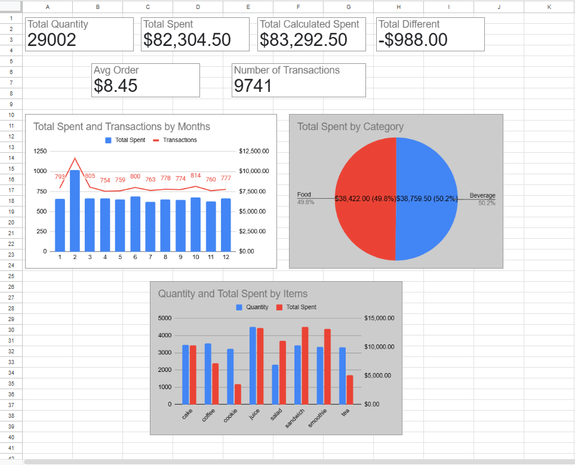

# cafe_sales_analysis_gsheets
Beginner level data analysis project using Google Sheets
Project Overview
Bu proje, Kaggle'dan elde edilen kafe satış verilerini analiz etmektedir. Amaç, temel performans göstergelerini (KPI'lar) kullanarak satış performansını, ürün katkısını ve aylık trendleri anlamaktır.
Dataset
Veri kümesi şunları içerir:
- Transaction ID
- Item
- Quantity
- Price per Unit
- Total Spent
- Transaction Date
Veri Hazırlığı
- Veri temizleme ve doğrulama işlemleri gerçekleştirildi
- Hesaplanan ve kaydedilen toplam harcama arasında veri kalitesi kontrolü yapıldı
Not
Google Sheets linki : "https://docs.google.com/spreadsheets/d/165eFuGujDfYF2tp3VIETb2LNNiEp65P5L8pn-nZh2-o/edit?gid=871986441#gid=871986441"

